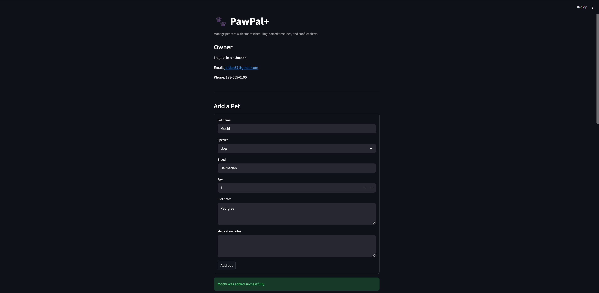

# PawPal+ (Module 2 Project)

PawPal+ is a Streamlit app that helps a pet owner organize care tasks, monitor recurring responsibilities, and review a daily schedule in one place.

## Features

- Owner and pet profile management so one owner can register multiple pets and keep their care details organized.
- Task scheduling for feeding, walking, medication, grooming, vet appointments, and other care activities.
- Chronological task sorting using each task's `due_time`, which builds a daily plan in time order instead of insertion order.
- Recurring task generation for `daily`, `weekly`, `biweekly`, `monthly`, and `yearly` schedules when a task is marked complete.
- Calendar-aware recurrence handling for month-end and leap-year dates, such as January 31 rolling to February 28 and February 29 rolling to February 28 in non-leap years.
- Exact-time conflict detection that groups tasks by timestamp and warns the user when two or more tasks are scheduled at the same time.
- Task filtering by completion status and by pet name so owners can quickly narrow the schedule to a specific pet or set of remaining tasks.
- Streamlit schedule views that display today's tasks, filterable tables, and visible conflict warnings in a polished dashboard-style layout.

## Scenario

A busy pet owner needs help staying consistent with pet care. They want an assistant that can:

- Track pet care tasks such as walks, feeding, medication, enrichment, and grooming.
- Consider constraints like time, priority, and scheduling conflicts.
- Produce a clear daily plan that is easy to review.

## What You Will Build

The app supports:

- Entering and viewing owner information.
- Adding and viewing pet profiles.
- Scheduling one-time or recurring care tasks.
- Reviewing today's schedule in chronological order.
- Filtering tasks by pet or completion status.
- Detecting exact-time conflicts before the day gets too crowded.

## Getting Started

### Setup

```bash
python -m venv .venv
source .venv/bin/activate  # Windows: .venv\Scripts\activate
pip install -r requirements.txt
```

### Run the App

```bash
streamlit run app.py
```

## Testing PawPal+

Run the automated test suite with:

```bash
python -m pytest
```

The tests cover the scheduler's most important behaviors, including task completion, pet task registration, filtering by status and pet name, chronological sorting, recurring task creation for supported frequencies, and exact-time conflict detection.

Confidence Level: ★★★★☆. The current test results are strong because the full suite passes, but reliability is not yet perfect since the app still has room for more UI-level and integration-level testing.

## Demo



## Suggested Workflow

1. Read the scenario carefully and identify requirements and edge cases.
2. Draft a UML diagram showing classes, attributes, methods, and relationships.
3. Convert the UML into Python class definitions.
4. Implement scheduling logic in small increments.
5. Add tests for the most important scheduler behaviors.
6. Connect the backend logic to the Streamlit UI in `app.py`.
7. Refine the UML so it matches the final implementation.
