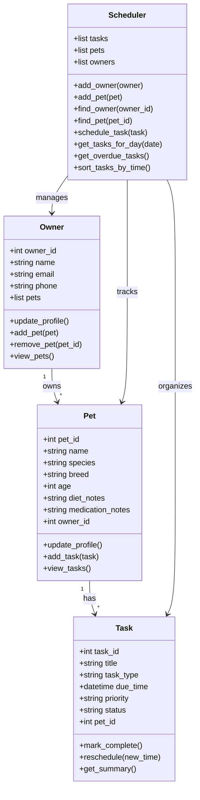

# PawPal+ Project Reflection

## 1. System Design

### Three (3) Core Actions that can be done on the PawPal+ App

- Be able to enter and store relevant, important information about the owner and the pet they own.
- Keep track of every dietary habits and nutritional needs (what the pet has for breakfast, lunch, dinner, midday/late afternoon snack, midnight meals, etc.), as well as any medications they have to take in on a regular basis
- Any vaccinations they need to take, they are yet to take, they have already taken, and any appointments pending and upcoming, and completed, with the veterinarian

**a. Initial design**

- My initial UML design used four main classes: `Owner`, `Pet`, `Task`, and `Scheduler`. I chose `Owner` to store the user's basic contact information and the pets that belong to them. I used `Pet` to represent each animal profile and hold information such as species, breed, age, food notes, and medication notes. I used `Task` to represent individual care actions like feeding, walking, medicine, or vet visits, along with details such as due time, priority, and completion status. Finally, I used `Scheduler` as the coordinating class that keeps track of owners, pets, and tasks so the app can organize daily care activities and show what needs to be done.

### Building Blocks

#### `Owner`

- Attributes: `owner_id`, `name`, `email`, `phone`, `pets`
- Methods: `update_profile()`, `add_pet()`, `remove_pet()`, `view_pets()`

#### `Pet`

- Attributes: `pet_id`, `name`, `species`, `breed`, `age`, `diet_notes`, `medication_notes`, `owner_id`
- Methods: `update_profile()`, `add_task()`, `view_tasks()`

#### `Task`

- Attributes: `task_id`, `title`, `task_type`, `due_time`, `priority`, `status`, `pet_id`
- Methods: `mark_complete()`, `reschedule()`, `get_summary()`

#### `Scheduler`

- Attributes: `tasks`, `pets`, `owners`
- Methods: `add_owner()`, `add_pet()`, `find_owner()`, `find_pet()`, `schedule_task()`, `get_tasks_for_day()`, `get_overdue_tasks()`, `sort_tasks_by_time()`

### Mermaid UML Draft

**b. Design changes**

- Yes. After reviewing the class skeleton, I noticed that the `Scheduler` stored lists of owners and pets but did not yet have clear methods for registering or looking them up. I added `add_owner()`, `add_pet()`, `find_owner()`, and `find_pet()` so the relationships between the classes are more explicit.
- I also noticed that the `Owner` class was missing a way to update owner information, so I added an `update_profile()` method to make the owner class more consistent with the pet profile design.
- I made these changes because they make the system easier to connect and maintain. The scheduler now has a cleaner way to manage relationships, and the owner class now supports profile updates the same way the pet class does.

---

## 2. Scheduling Logic and Tradeoffs

**a. Constraints and priorities**

- What constraints does your scheduler consider (for example: time, priority, preferences)?
- How did you decide which constraints mattered most?

**b. Tradeoffs**

- Describe one tradeoff your scheduler makes.
- Why is that tradeoff reasonable for this scenario?

---

## 3. AI Collaboration

**a. How you used AI**

- How did you use AI tools during this project (for example: design brainstorming, debugging, refactoring)?
- What kinds of prompts or questions were most helpful?

**b. Judgment and verification**

- Describe one moment where you did not accept an AI suggestion as-is.
- How did you evaluate or verify what the AI suggested?

---

## 4. Testing and Verification

**a. What you tested**

- What behaviors did you test?
- Why were these tests important?

**b. Confidence**

- How confident are you that your scheduler works correctly?
- What edge cases would you test next if you had more time?

---

## 5. Reflection

**a. What went well**

- What part of this project are you most satisfied with?

**b. What you would improve**

- If you had another iteration, what would you improve or redesign?

**c. Key takeaway**

- What is one important thing you learned about designing systems or working with AI on this project?
