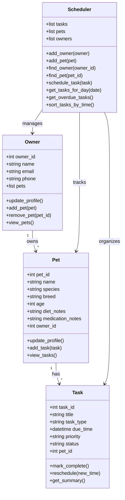

# PawPal+ Project Reflection

## 1. System Design

### Three (3) Core Actions that can be done on the PawPal+ App

- Be able to enter and store relevant, important information about the owner and the pet they own.
- Keep track of every dietary habits and nutritional needs (what the pet has for breakfast, lunch, dinner, midday/late afternoon snack, midnight meals, etc.), as well as any medications they have to take in on a regular basis
- Any vaccinations they need to take, they are yet to take, they have already taken, and any appointments pending and upcoming, and completed, with the veterinarian

**a. Initial design**

- My initial UML design used four main classes: `Owner`, `Pet`, `Task`, and `Scheduler`. I chose `Owner` to store the user's basic contact information and the pets that belong to them. I used `Pet` to represent each animal profile and hold information such as species, breed, age, food notes, and medication notes. I used `Task` to represent individual care actions like feeding, walking, medicine, or vet visits, along with details such as due time, priority, and completion status. Finally, I used `Scheduler` as the coordinating class that keeps track of owners, pets, and tasks so the app can organize daily care activities and show what needs to be done.

### Building Blocks

#### `Owner`

- Attributes: `owner_id`, `name`, `email`, `phone`, `pets`
- Methods: `update_profile()`, `add_pet()`, `remove_pet()`, `view_pets()`

#### `Pet`

- Attributes: `pet_id`, `name`, `species`, `breed`, `age`, `diet_notes`, `medication_notes`, `owner_id`
- Methods: `update_profile()`, `add_task()`, `view_tasks()`

#### `Task`

- Attributes: `task_id`, `title`, `task_type`, `due_time`, `priority`, `status`, `pet_id`
- Methods: `mark_complete()`, `reschedule()`, `get_summary()`

#### `Scheduler`

- Attributes: `tasks`, `pets`, `owners`
- Methods: `add_owner()`, `add_pet()`, `find_owner()`, `find_pet()`, `schedule_task()`, `get_tasks_for_day()`, `get_overdue_tasks()`, `sort_tasks_by_time()`

### Mermaid UML Draft

**b. Design changes**

- Yes. After reviewing the class skeleton, I noticed that the `Scheduler` stored lists of owners and pets but did not yet have clear methods for registering or looking them up. I added `add_owner()`, `add_pet()`, `find_owner()`, and `find_pet()` so the relationships between the classes are more explicit.
- I also noticed that the `Owner` class was missing a way to update owner information, so I added an `update_profile()` method to make the owner class more consistent with the pet profile design.
- I made these changes because they make the system easier to connect and maintain. The scheduler now has a cleaner way to manage relationships, and the owner class now supports profile updates the same way the pet class does.

---

## 2. Scheduling Logic and Tradeoffs

**a. Constraints and priorities**

- What constraints does your scheduler consider (for example: time, priority, preferences)?
- How did you decide which constraints mattered most?

**b. Tradeoffs**

- One tradeoff my scheduler makes is in conflict detection. It only checks whether two tasks have the exact same scheduled `due_time` instead of checking whether task durations overlap. This is a simpler algorithm because each task can be grouped by one timestamp and compared quickly, but it means the app may miss softer conflicts such as a 30-minute walk overlapping with a vet appointment that starts 15 minutes later.
- I think this tradeoff is reasonable for this scenario because the project is still focused on core scheduling behavior, readability, and terminal or Streamlit output. A more advanced overlap algorithm would require storing task durations consistently and adding more complex comparison logic. For a small pet-owner scheduler, exact-time conflict warnings provide useful feedback without making the code much harder to understand.

---

## 3. AI Collaboration

**a. How you used AI**

- I used VS Code Copilot Chat as a design partner, code helper, and review assistant across different phases of the project. Early on, it was most helpful for brainstorming class responsibilities and checking whether my UML design had the right relationships between `Owner`, `Pet`, `Task`, and `Scheduler`. Later, I used it to help draft scheduler methods, think through recurring task behavior, and suggest test cases for sorting, filtering, and conflicts. Near the end, it was useful for polishing the Streamlit interface.
- The most effective Chat features were code-aware prompts that referenced the current file or the broader codebase. Prompts such as "What edge cases should I test for sorting and recurring tasks?" and "Does my UML still match this final implementation?" were especially helpful because they pushed the AI to reason about relationships and behavior instead of only generating code. I also found test-generation style prompts useful because they exposed missing cases like one-time tasks that should not create a follow-up task.

**b. Judgment and verification**

- One AI suggestion I chose not to accept as is was the idea of making the conflict detection logic much more advanced by tracking overlapping durations for every task. I decided that would make the system heavier than it needed to be for this phase. Instead, I kept the cleaner design where the scheduler groups tasks by exact `due_time` and warns the user about duplicate timestamps. That choice kept the system aligned with the project scope and easier to test.
- I evaluated AI suggestions by checking whether they fit my class design, whether they made the code easier to explain, and whether I could verify the behavior with tests. I used `pytest` to confirm that sorting, recurring task creation, and conflict detection worked as expected. If a suggestion added complexity without improving the main user experience or testability, I either simplified it or rejected it.

**c. Reflecting on AI strategy**

- Using separate chat sessions for different phases helped me stay organized because each conversation had a clear job. One session focused on system design and UML, another focused on implementing the scheduler methods, another focused on testing, and another focused on the Streamlit UI and documentation. That separation reduced confusion, made it easier to track decisions, and kept me from mixing high-level design questions with small debugging details.
- Working with Copilot taught me that I still needed to act as the lead architect. The AI was fast at generating ideas, examples, and code drafts, but it did not automatically know which tradeoffs were best for my project. I had to decide what belonged in each class, what features were worth implementing now, what was too complex for the assignment, and how to verify that the final system was reliable. The biggest lesson was that AI works best when I give it direction, review its output critically, and keep ownership of the design decisions.

---

## 4. Testing and Verification

**a. What you tested**

- I tested the scheduler behaviors that mattered most to reliability: marking tasks complete, adding tasks to a pet, filtering tasks by status, filtering tasks by pet name, combining both filters, sorting tasks by due time, recurring task creation for daily, weekly, biweekly, monthly, and yearly schedules, and exact-time conflict detection for both the same pet and different pets.
- These tests were important because they covered the parts of the system most likely to affect the user's daily planning experience. If sorting failed, the schedule would be confusing. If recurring logic failed, owners could miss routine care like feeding or medication. If conflict detection failed, the app could hide schedule problems instead of warning the user. Testing these behaviors gave me confidence that the app's core scheduling logic works as intended.

**b. Confidence**

- I feel confident in the scheduler's core reliability because the automated test suite passes and it covers the main scheduling features that I implemented. I would describe my confidence as about 4 out of 5 stars. The backend logic for sorting, filtering, recurring tasks, and conflict detection is in good shape, but I know there is still room for more integration and UI-level testing.
- If I had more time, I would test additional edge cases such as scheduling a task for an unknown pet, duplicate owner or task IDs, empty schedules, pets with no tasks, filtering by a pet name that does not exist, and more complex recurrence cases. I would also add tests for the Streamlit interface to confirm that conflict warnings, filtered task tables, and sorted schedule views appear correctly for the user.

---

## 5. Reflection

**a. What went well**

- I am most satisfied with how the project grew from a simple class design into a working system with meaningful scheduler behavior. The recurring task logic, sorting, filtering, and conflict detection made the project feel smarter than a basic task list, and I was also happy that I connected those backend features to the Streamlit UI so the user can actually see and use them.

**b. What you would improve**

- If I had another iteration, I would improve the scheduler by adding task durations and smarter overlap detection instead of checking only exact duplicate times. I would also consider adding editing and deletion for tasks in the UI, clearer support for overdue tasks, and more detailed explanations for why the schedule is ordered the way it is. On the design side, I might also rethink whether some helper logic belongs in the `Scheduler` or should be separated into a dedicated planning service if the app keeps growing.

**c. Key takeaway**

- One important thing I learned is that good system design comes from making deliberate choices about responsibility and complexity. AI can generate code quickly, but it is still my job to decide what the system should optimize for, what tradeoffs are acceptable, and how to keep the design understandable. This project showed me that the best results come from treating AI as a strong collaborator while still staying responsible for the architecture, testing, and final decisions.
